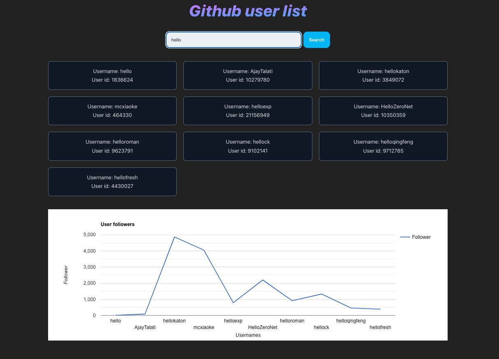

# Github user list

> [!NOTE]    
> As a system user, I want to get a user list from Github. <br>
> As a system user, I want to see each user's followers in a bar chart. <br>

- Tasks
  - [x] Add pages: home user page, user profile page, not found page
  - [x] Add a text input field and a button.
  - [x] Add a validator that verifies that the user's search text has a minimum of 4 characters, and does not allow searching for non-pemessive words (i.e: tanvir).
  - [x] Endpoints
    - [GET users](https://docs.github.com/en/rest/search/search?apiVersion=2022-11-28#search-users)
    - [GET user info](https://docs.github.com/en/rest/users/users?apiVersion=2022-11-28#get-a-user)
  - [x] Show the <ins>first 10 users of the search result</ins>, including i.e: their username and id of each record.
  - [x] Create a simple bar chart to show the number of followers of the top 10 users. Use of ([react-google charting library](https://www.react-google-charts.com/)).
  - [x] Convert each user profile into a link, so that clicking on each record navigates to a path that includes the 'username' property as a parameter. Add user's image and some user information.
  - [x] Display General Error messages throughout the application.
  - [x] Third party library for icons, i.e: [Font Awesome](https://fontawesome.com/v5/docs/web/use-with/react)

## Technologies

- Vite (v5) with HMR and some ESLint rules + SWC compiler
- React with TS
- SCSS Modules
- [Github REST API](https://docs.github.com/en/rest?apiVersion=2022-11-28)

## Installation

- Requirements
  - Node: v18+
  - Npm
- Execution
  ```bash
  npm install
  npm run dev
  ```

## Demo

<p align='center'></p>
